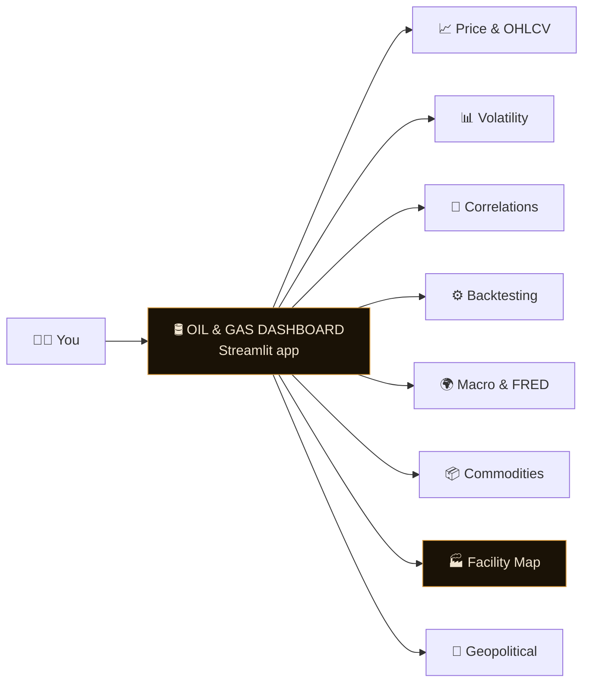
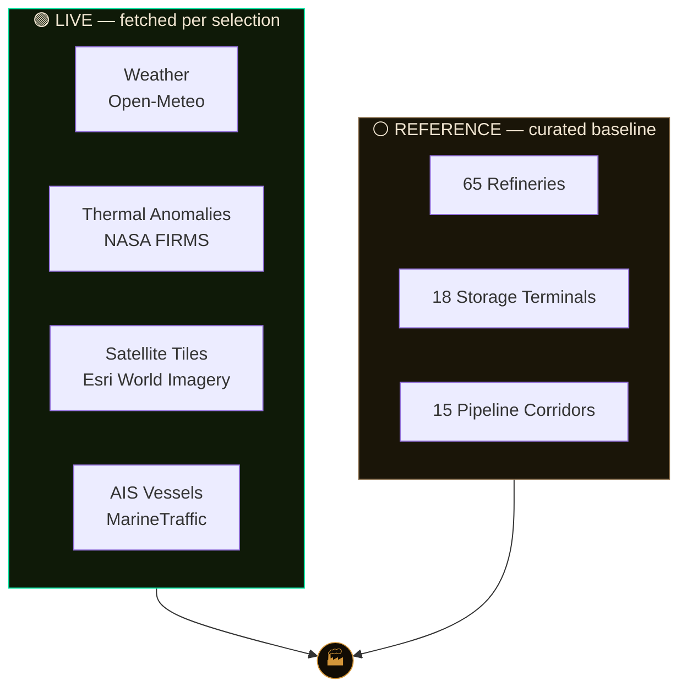

<div align="center">

# 🛢️ GLOBAL OIL & GAS RESEARCH DASHBOARD

**A professional-grade, single-file research console for global crude oil and natural gas markets — price action, volatility, correlations, backtesting, macro, facilities, and live geopolitical news, all keyless.**


</div>

---

## 🖥 What you're looking at



Every source is **100% keyless** — no API registration, no secrets file, nothing to configure. Clone it and run it.

---

## 🏭 Facility Intelligence Panel

The centerpiece: select any refinery or storage terminal on the **Facility Map** to open a 4-tab intelligence panel with live weather, thermal anomaly detection, satellite imagery, and vessel tracking for that exact location.



**Interactions:**
- 🗺 Pick a refinery or terminal from the dropdown to center the intelligence panel on it
- 🌤 **Weather** — current conditions + 24h wind & precipitation forecast
- 🔥 **NASA FIRMS** — VIIRS + MODIS thermal anomaly detection, 24h global, 50km radius (persistent hits at refineries indicate routine flaring)
- 🛰 **Satellite** — 3×3 Esri tile mosaic at selectable zoom, plus jump-out links to Google Maps, Esri Wayback, and Google Earth Timelapse
- 🚢 **AIS Tracking** — live vessel positions near the selected terminal via MarineTraffic embed

---

## 📊 Feature Map

| Tab | Highlights | Stack |
|---|---|---|
| 📈 **Price & OHLCV** | Candlestick / OHLC / line charts, volume, moving averages, normalised multi-asset comparison | Streamlit + Plotly |
| 📊 **Volatility** | Rolling annualised volatility, drawdown series, return distribution, Q-Q plot, descriptive stats | Streamlit + Plotly |
| 🔗 **Correlations** | Pearson correlation heatmap, rolling pairwise correlation | Streamlit + Plotly |
| ⚙ **Backtesting** | MA crossover strategy, Sharpe ratio, max drawdown, equity curve, signal markers — no lookahead bias | Streamlit + Plotly |
| 🌍 **Macro & FRED** | Yields, DXY, gold, copper, VIX, FX rates via Yahoo Finance | Streamlit + Plotly |
| 📦 **Commodities** | Multi-commodity price history, YoY returns, rolling volatility, correlation matrix | Streamlit + Plotly |
| 🏭 **Facility Map** | ~65 refineries, 18 storage terminals, 15 pipeline corridors + intelligence panel | Streamlit + pydeck |
| 📰 **Geopolitical** | Live energy news from 5 RSS feeds, keyword-filtered, with price event overlays | Streamlit |

---

## 🚀 Quick Start

```bash
git clone https://github.com/your-username/oil-gas-dashboard.git
cd oil-gas-dashboard
pip install -r requirements.txt
streamlit run oil_gas_research.py
```

Python 3.9+. Runs fully without any API keys — every source below is public and keyless.

> ⚠️ **Deploy note:** NASA FIRMS NRT CSV downloads may be blocked on some cloud networks. When that happens the app automatically falls back to an embedded interactive FIRMS map.

---

## 📁 Repository Structure

```
.
├── oil_gas_research.py   # Complete single-file application (~2400 lines)
├── requirements.txt      # Python dependencies
└── README.md
```

`oil_gas_research.py` is internally organized as:

```
Imports
Constants          (tickers, macro series, facility data, geo events)
Page config + CSS  (Bebas Neue + Barlow typography, dark theme)
Plot theme         (Plotly dark theme, colour palette)
Utility functions  (rgba, apply_theme, prov_tag, dl_button)
Data fetchers      (Yahoo Finance, NASA FIRMS, Open-Meteo, Esri, RSS)
Analysis functions (volatility, drawdown, correlation, MA backtest)
Sidebar            (controls, benchmarks, analysis parameters)
Hero + KPI strip
8 tab bodies
```

Deliberately kept as a single file for easy deployment and portability.

---

## ⚙️ Configuration

**None required.** Every data source is public and keyless — clone, install, run. There is no `secrets.toml` and no environment variables to set, on Streamlit Cloud or anywhere else.

---

## 🏗 Architecture Notes

```mermaid
flowchart LR
    A["Sidebar control<br/>changed"] --> B["Relevant fetcher<br/>re-runs"]
    B --> C["st.cache_data<br/>TTL per source"]
    C --> D["Render tab"]

    style C fill:#0f1a08,stroke:#00e5a0
```



- **Per-source caching** — every fetcher has its own TTL (5 min for prices, up to 1 hour for macro/satellite/FIRMS), so a slow refresh on one source never blocks the rest of the app.
- **Facility Intelligence Panel** — built as an on-demand 4-source join keyed on the selected facility's coordinates, rather than pre-fetching all 83 facilities up front.
- **Lookahead-safe backtest** — the MA crossover signal is lagged by one day before it's applied to returns.
- **Graceful FIRMS fallback** — cloud networks that block the NRT CSV endpoint automatically drop to an embedded interactive FIRMS map instead of failing.
- **Single-file design** — no module split; everything from constants to tab bodies lives in `oil_gas_research.py` for one-file portability.

---

## 🧰 Tech Stack

<div align="center">

| Layer | Technology | Used for |
|---|---|---|
| App framework |  | Tabs, sidebar, widgets, session state, caching |
| Language |  | Fetchers, data wrangling, analysis |
| Maps |  | Facility Map |
| Charts |  | Price, volatility, correlation, backtest charts |
| Data |   | DataFrames, numeric ops on live feeds |
| Market data |  | OHLCV futures, ETFs, macro indicators, FX |
| Networking |  | NASA FIRMS, Open-Meteo, Esri, RSS |
| Images |  | Satellite tile mosaic stitching |

</div>

### External data sources

<div align="center">

         

</div>

---

## 📐 Instruments Covered

**Futures & ETFs**
WTI Crude (CL=F) · Brent Crude (BZ=F) · Natural Gas (NG=F) · RBOB Gasoline (RB=F) · Heating Oil (HO=F) · Copper (HG=F) · Gold (GC=F) · US Oil ETF (USO) · Natural Gas ETF (UNG) · Energy Sector ETF (XLE)

**Macro Indicators (via Yahoo Finance)**
10Y / 2Y / 30Y Treasury Yields (^TNX, ^IRX, ^TYX) · US Dollar Index (DX-Y.NYB) · S&P 500 (^GSPC) · VIX (^VIX) · EUR/USD · USD/CNY

**Facility Data (curated)**
65 major refineries across 7 regions · 18 strategic/commercial storage terminals · 15 major pipeline corridors

---

## 🧮 Analysis Methodology

| Method | Details |
|---|---|
| **MA Crossover Backtest** | Long when Fast MA > Slow MA, short when Fast MA < Slow MA; signal lagged 1 day to prevent lookahead bias; transaction costs not included; reports total return vs. buy-and-hold, annualised volatility, Sharpe ratio, max drawdown, signal flips |
| **Volatility** | Annualised via `daily_std × √252`; rolling window configurable 10–60 days |
| **Correlation** | Pearson correlation on daily percentage returns; configurable rolling pairwise window |
| **NASA FIRMS** | Queries VIIRS S-NPP, NOAA-20 VIIRS, and MODIS NRT CSVs; filters to a 50km box around the selected facility; Fire Radiative Power (FRP, MW) used as severity proxy |

---

## ⏱ Caching Strategy

| Data Type | Cache TTL |
|---|---|
| OHLCV prices | 5 minutes |
| Multi-ticker comparison | 5 minutes |
| Commodity history | 5 minutes |
| Weather | 30 minutes |
| RSS news feeds | 15 minutes |
| NASA FIRMS | 1 hour |
| Satellite tiles | 1 hour |
| Macro indicators | 1 hour |

---

## 🎨 Design

- **Background** — layered radial gradient (cool blue-indigo + warm amber) with SVG fractal noise grain overlay
- **Display font** — [Bebas Neue](https://fonts.google.com/specimen/Bebas+Neue) for headers, metric values, section titles
- **Body font** — [Barlow](https://fonts.google.com/specimen/Barlow) for body text, news cards, descriptions
- **Label font** — [Barlow Condensed](https://fonts.google.com/specimen/Barlow+Condensed) for widget labels, metadata, chart axes
- **Accent colour** — `#d4963a` (petroleum amber / gold)

---

## 🧭 Known Limitations

- Prices delayed ~15 min (Yahoo Finance free tier) — not suitable for live trading.
- NASA FIRMS NRT CSV covers the last 24 hours only, not a historical archive.
- MarineTraffic free embed has limited vessel detail vs. a paid API.
- Esri satellite tiles are periodically updated composites, not truly live.
- Facility data is a curated static dataset; capacity figures may not reflect current operational status.

---

## 📄 License

Released under the [MIT License](LICENSE) — free to use, modify, and distribute, including commercially.

<div align="center">

---

*Built with Streamlit · Plotly · pandas · yfinance*

</div>
