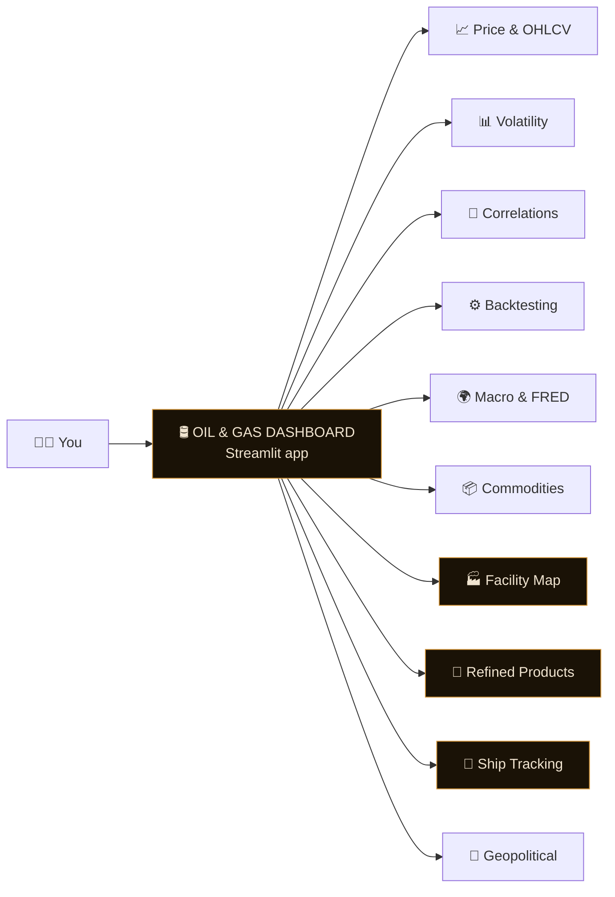
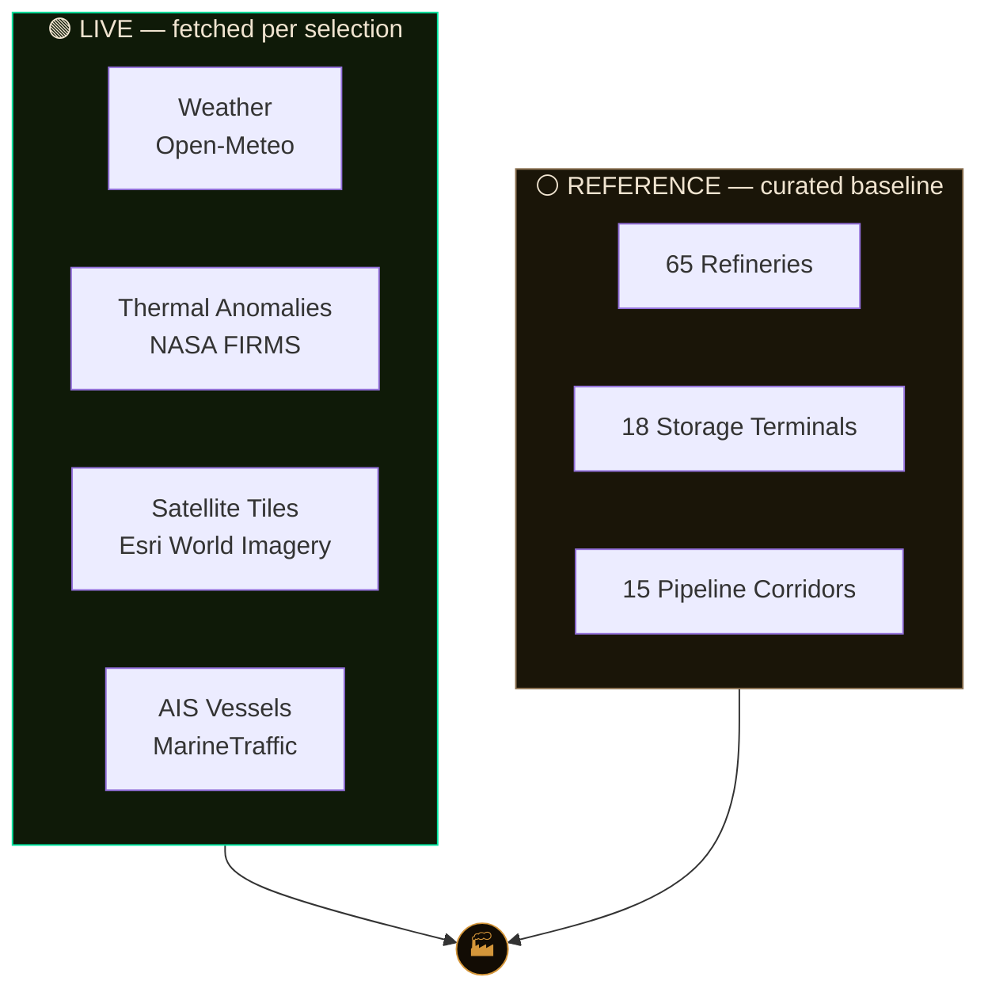
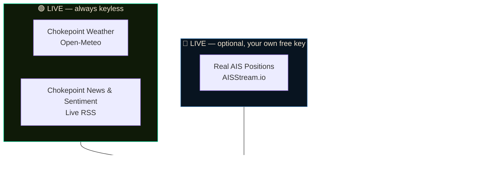

<div align="center">

# 🛢️ GLOBAL OIL & GAS RESEARCH DASHBOARD

**A professional-grade, single-file research console for global crude oil and natural gas markets — price action, volatility, correlations, backtesting, macro, downstream refined products, maritime tanker tracking, facilities, and live geopolitical news.**


</div>

---

## 🖥 What you're looking at



Almost every source is **keyless out of the box** — no API registration, no secrets file, nothing to configure. Clone it and run it. The one optional exception is live vessel positions in **Ship Tracking**, which needs a free key from a third-party AIS provider — everything else, including that tab's chokepoint weather and news, is keyless too.

---

## 🏭 Facility Intelligence Panel

Select any refinery or storage terminal on the **Facility Map** to open a 4-tab intelligence panel with live weather, thermal anomaly detection, satellite imagery, and vessel tracking for that exact location.



**Interactions:**
- 🗺 Pick a refinery or terminal from the dropdown to center the intelligence panel on it
- 🌤 **Weather** — current conditions + 24h wind & precipitation forecast
- 🔥 **NASA FIRMS** — VIIRS + MODIS thermal anomaly detection, 24h global, 50km radius (persistent hits at refineries indicate routine flaring)
- 🛰 **Satellite** — 3×3 Esri tile mosaic at selectable zoom, plus jump-out links to Google Maps, Esri Wayback, and Google Earth Timelapse
- 🚢 **AIS Tracking** — live vessel positions near the selected terminal via MarineTraffic embed

---

## 🧪 Refined Product Intelligence

Downstream analytics on top of the crude data above — crude oil is a single input to a **joint-output** refining process, so this tab treats refined products as their own analytical surface.

- **Live crack spreads** — single-product crack (`product $/gal × 42 − crude $/bbl`) for Gasoline (RBOB) and Diesel/ULSD, plus the industry-standard **3:2:1 crack spread**, all computed from live Yahoo Finance futures.
- **Jet Fuel proxy** — no free jet fuel future exists; Jet Fuel is derived from live ULSD with a documented, transparent seasonal basis model (±3.5% amplitude, peak mid-July aviation season) so it's visibly distinct from plain Diesel — clearly labeled as modeled, not a live traded price.
- **ML crack-spread forecaster** — `GradientBoostingRegressor`, walk-forward validated with `TimeSeriesSplit`, reporting an honest out-of-fold MAE and feature importances.
- **Seasonal decomposition** — STL trend/seasonal/residual split (~quarterly cycle).
- **Supply stress detector** — `IsolationForest` flags statistically anomalous crack-spread sessions.
- **Per-product disruption signal** — reuses the same live RSS feed as the Geopolitical tab, tagged per product and scored with a small hand-built energy lexicon.
- **Non-tradable product reference panel** — Naphtha, Fuel Oil, Asphalt, Lubricants, Wax, Petroleum Jelly, Refinery Gases have no free live price, so they're shown as a static EIA-benchmark yield/driver/sensitivity reference rather than a fabricated forecast.

---

## 🚢 Ship Tracking — Maritime Intelligence

A tanker-fleet tracking and risk-scoring console covering Panamax, Aframax, Suezmax, VLCC, and ULCC classes, built in clearly-separated data tiers so nothing live gets blended with anything simulated.



**Always-live, keyless:**
- 🌐 **Chokepoint weather** — real current conditions at Hormuz, Suez/Red Sea, Malacca, Panama, and the Bosphorus via Open-Meteo, with a high-wind transit-risk flag.
- 📰 **Chokepoint news & sentiment** — the same live RSS feed as the Geopolitical tab, tagged per chokepoint and scored into a 🔴/🟠/🟡/🟢 tension flag.

**Optional live, your own free key:**
- 📡 **Connect Live AIS** — a real WebSocket client against [AISStream.io](https://aisstream.io)'s free tier. Paste your own key (used only for the session, never stored or hard-coded), pick chokepoints to monitor, and listen for a short window to observe genuine tanker AIS traffic (`PositionReport` + `ShipStaticData`, filtered to AIS tanker type codes 80–89). Free-tier coverage is sparse — a quiet result is a real property of the feed, not a bug.

**Demo (clearly labeled, never blended with the live numbers above):**
- A 40–200 vessel simulated fleet with full AIS-style fields, routed between 18 real crude-trade hub ports, with ~10% carrying an intentionally injected anomaly (speed drop, route deviation, AIS gap, loitering).
- **ETA prediction** — `GradientBoostingRegressor` (quantile loss) with an honest 10th–90th percentile interval.
- **Anomaly detection** — `IsolationForest` producing a 0–100 AI Anomaly Score.
- **Operational Risk Indicator** — an explainable, weighted composite (AIS reliability, route deviation, anomaly score, ETA deviation) that deliberately **excludes flag state, nationality, and geographic origin** as inputs. Every score ships with a plain-English factor breakdown.
- **AIS Data Quality & Validation** — a 0–100 per-record reliability score (staleness, coordinate plausibility, speed/draught sanity) computed *before* any other model trusts the record — the same ingestion-validation step a real AIS pipeline needs.
- **Predictive Port Congestion** — estimated berth wait time per destination port, from the ratio of approaching/anchored vessels to a synthetic per-port berth capacity.
- **Fuel Efficiency Intelligence** — the naval-architecture cube-law approximation (fuel burn ∝ speed³) estimating excess/saved burn vs. each vessel class's design-optimal speed — explicitly labeled a model estimate, not measured fuel consumption (no engine telemetry exists in AIS).
- **Configurable alert engine**, per-vessel intelligence panel with historical track, fleet-wide analytics, and dedicated **Responsible AI / Model Governance** and **Business Process Integration** sections.

> This tab is a decision-support prototype, not a production maritime-intelligence platform — no persistent database, multi-page architecture, auth, or paid commercial AIS contract. Every AI output is explicitly framed as a decision-support signal for human review, never a definitive security, criminal, or cargo classification.

---

## 📊 Feature Map

| Tab | Highlights | Stack |
|---|---|---|
| 📈 **Price & OHLCV** | Candlestick / OHLC / line charts, volume, moving averages, normalised multi-asset comparison | Streamlit + Plotly |
| 📊 **Volatility** | Rolling annualised volatility, drawdown series, return distribution, Q-Q plot, descriptive stats | Streamlit + Plotly |
| 🔗 **Correlations** | Pearson correlation heatmap, rolling pairwise correlation | Streamlit + Plotly |
| ⚙ **Backtesting** | MA crossover strategy, Sharpe ratio, max drawdown, equity curve, signal markers — no lookahead bias | Streamlit + Plotly |
| 🌍 **Macro & FRED** | Yields, DXY, gold, copper, VIX, FX rates via Yahoo Finance | Streamlit + Plotly |
| 📦 **Commodities** | Multi-commodity price history, YoY returns, rolling volatility, correlation matrix | Streamlit + Plotly |
| 🏭 **Facility Map** | ~65 refineries, 18 storage terminals, 15 pipeline corridors + intelligence panel | Streamlit + pydeck |
| 🧪 **Refined Products** | Live crack spreads (Gasoline, Diesel, modeled Jet Fuel), ML forecaster, STL seasonality, supply-stress detector, non-tradable product reference | Streamlit + Plotly + scikit-learn + statsmodels |
| 🚢 **Ship Tracking** | Live chokepoint weather/news, optional live AIS, demo tanker fleet with ETA/anomaly/risk ML, port congestion, fuel efficiency, AIS data-quality validation | Streamlit + Plotly + scikit-learn + websockets |
| 📰 **Geopolitical** | Live energy news from 5 RSS feeds, keyword-filtered, with price event overlays | Streamlit |

---

## 🚀 Quick Start

```bash
git clone https://github.com/your-username/oil-gas-dashboard.git
cd oil-gas-dashboard
pip install -r requirements.txt
streamlit run oil_gas_dashboard.py
```

Python 3.9+ (3.11/3.12 recommended — see the `runtime.txt` note below). Runs fully without any API keys, with the sole exception of the optional live-AIS panel inside **Ship Tracking**, which needs your own free key from [AISStream.io](https://aisstream.io) (never required — the tab works fully in demo mode without one).

> ⚠️ **Deploy note (FIRMS):** NASA FIRMS NRT CSV downloads may be blocked on some cloud networks. When that happens the app automatically falls back to an embedded interactive FIRMS map.

> ⚠️ **Deploy note (Python version):** on Streamlit Cloud, pin the interpreter with a `runtime.txt` containing `python-3.12` in the repo root. Left unpinned, Streamlit Cloud may select a very new Python version for which `numpy`/`pandas`/`scikit-learn`/`statsmodels` don't yet have prebuilt wheels, forcing a slow (or failing) source build.

---

## 📁 Repository Structure

```
.
├── oil_gas_dashboard.py   # Complete single-file application (~4300 lines)
├── requirements.txt       # Python dependencies
├── runtime.txt            # Pins the Python version for Streamlit Cloud
└── README.md
```

`oil_gas_dashboard.py` is internally organized as:

```
Imports                        (incl. optional websockets import for live AIS)
Constants                      (tickers, macro series, facility data, geo events,
                                 refined-product constants, vessel classes,
                                 ports, chokepoints)
Page config + CSS              (Bebas Neue + Barlow typography, dark theme)
Plot theme                     (Plotly dark theme, colour palette)
Utility functions               (rgba, apply_theme, prov_tag, dl_button)
Data fetchers                   (Yahoo Finance, NASA FIRMS, Open-Meteo, Esri, RSS)
Analysis functions               (volatility, drawdown, correlation, MA backtest)
Refined-products ML pipeline    (crack spreads, GBR forecaster, STL, IsolationForest)
Ship-tracking simulation + ML    (demo fleet generator, ETA/anomaly/risk models,
                                  data-quality validation, port congestion,
                                  fuel-efficiency estimator)
Ship-tracking live data           (chokepoint weather/news, AISStream.io adapter)
Sidebar                         (controls, benchmarks, analysis parameters)
Hero + KPI strip
10 tab bodies
```

Deliberately kept as a single file for easy deployment and portability.

---

## ⚙️ Configuration

**None required for the default experience.** Every data source is public and keyless — clone, install, run. There is no `secrets.toml` and no environment variables to set, on Streamlit Cloud or anywhere else.

The one optional exception: to try the **live AIS** panel in Ship Tracking, paste your own free [AISStream.io](https://aisstream.io) key directly into the in-app password field for that session. It is never stored, written to disk, or hard-coded — if you'd rather not type it each session, you can instead read it from `st.secrets["AIS_API_KEY"]` or an environment variable in your own fork.

---

## 🏗 Architecture Notes

```mermaid
flowchart LR
    A["Sidebar control<br/>changed"] --> B["Relevant fetcher<br/>re-runs"]
    B --> C["st.cache_data<br/>TTL per source"]
    C --> D["Render tab"]

    style C fill:#0f1a08,stroke:#00e5a0
```



- **Per-source caching** — every fetcher has its own TTL (5 min for prices, up to 1 hour for macro/satellite/FIRMS), so a slow refresh on one source never blocks the rest of the app.
- **Per-ticker fetch loop, not batched** — multi-ticker series (correlations, macro, commodities) are fetched one ticker at a time via `yf.Ticker().history()` rather than a single batched `yf.download()` call, which is the one that silently returns empty frames or gets rate-limited on shared cloud IPs.
- **Facility Intelligence Panel** — built as an on-demand 4-source join keyed on the selected facility's coordinates, rather than pre-fetching all 83 facilities up front.
- **Lookahead-safe backtest and ML forecasts** — the MA crossover signal is lagged by one day, and the refined-products/ETA models are walk-forward validated (`TimeSeriesSplit`) rather than randomly split.
- **AIS ingestion → validation → ML** — Ship Tracking's demo fleet runs through an explicit data-quality validation pass (staleness, coordinate/speed/draught plausibility) before its output feeds the ETA, anomaly, risk, or fuel-efficiency models, mirroring the ingestion-validation stage a real AIS pipeline needs.
- **Graceful FIRMS fallback** — cloud networks that block the NRT CSV endpoint automatically drop to an embedded interactive FIRMS map instead of failing.
- **Demo vs. live, never blended** — Ship Tracking's simulated fleet and its live chokepoint/AIS data are computed independently and labeled separately in the UI.
- **Single-file design** — no module split; everything from constants to tab bodies lives in `oil_gas_dashboard.py` for one-file portability.

---

## 🧰 Tech Stack

<div align="center">

| Layer | Technology | Used for |
|---|---|---|
| App framework |  | Tabs, sidebar, widgets, session state, caching |
| Language |  | Fetchers, data wrangling, analysis |
| Maps |  | Facility Map |
| Charts |  | Price, volatility, correlation, backtest, crack-spread & vessel-map charts |
| Data |   | DataFrames, numeric ops on live feeds |
| Machine learning |  | GradientBoostingRegressor (crack-spread & ETA forecasting), IsolationForest (supply-stress & AIS anomaly detection) |
| Statistics |  | STL seasonal decomposition of crack spreads |
| Market data |  | OHLCV futures, ETFs, macro indicators, FX, refined-product futures |
| Networking |  | NASA FIRMS, Open-Meteo, Esri, RSS |
| Live AIS (optional) |  | Real-time AIS message streaming from AISStream.io |
| Images |  | Satellite tile mosaic stitching |

</div>

### External data sources

<div align="center">

     -1a1a2e)     

</div>

All keyless except **AISStream.io**, which is free but requires the user's own registration.

---

## 📐 Instruments Covered

**Futures & ETFs**
WTI Crude (CL=F) · Brent Crude (BZ=F) · Natural Gas (NG=F) · RBOB Gasoline (RB=F) · Heating Oil / ULSD (HO=F) · Copper (HG=F) · Gold (GC=F) · US Oil ETF (USO) · Natural Gas ETF (UNG) · Energy Sector ETF (XLE)

**Refined Products**
Gasoline (RBOB, live) · Diesel/ULSD (live) · Jet Fuel (modeled seasonal basis off ULSD) · Naphtha, Fuel Oil, Asphalt, Lubricating Oils, Paraffin Wax, Petroleum Jelly, Refinery Gases (static EIA-benchmark reference, no live price exists)

**Macro Indicators (via Yahoo Finance)**
10Y / 2Y / 30Y Treasury Yields (^TNX, ^IRX, ^TYX) · US Dollar Index (DX-Y.NYB) · S&P 500 (^GSPC) · VIX (^VIX) · EUR/USD · USD/CNY

**Facility Data (curated)**
65 major refineries across 7 regions · 18 strategic/commercial storage terminals · 15 major pipeline corridors

**Maritime Vessel Classes**
Panamax · Aframax · Suezmax · VLCC · ULCC — demo fleet of 40–200 vessels, or real observed traffic via optional live AIS, monitored across 5 major chokepoints (Hormuz, Suez/Red Sea, Malacca, Panama, Bosphorus) and 18 crude-trade hub ports

---

## 🧮 Analysis Methodology

| Method | Details |
|---|---|
| **MA Crossover Backtest** | Long when Fast MA > Slow MA, short when Fast MA < Slow MA; signal lagged 1 day to prevent lookahead bias; transaction costs not included; reports total return vs. buy-and-hold, annualised volatility, Sharpe ratio, max drawdown, signal flips |
| **Volatility** | Annualised via `daily_std × √252`; rolling window configurable 10–60 days |
| **Correlation** | Pearson correlation on daily percentage returns; configurable rolling pairwise window |
| **NASA FIRMS** | Queries VIIRS S-NPP, NOAA-20 VIIRS, and MODIS NRT CSVs; filters to a 50km box around the selected facility; Fire Radiative Power (FRP, MW) used as severity proxy |
| **Crack Spread** | Single-product: `(product $/gal × 42) − crude $/bbl`. 3:2:1 industry-standard: `[(2×gasoline $/bbl) + (1×diesel $/bbl) − (3×crude $/bbl)] / 3` |
| **Crack-Spread & ETA Forecasting** | `GradientBoostingRegressor`; crack spreads use lagged levels/momentum/rolling volatility/calendar features validated with 5-fold `TimeSeriesSplit`; ETA prediction uses quantile loss (10th/50th/90th percentile) for an honest prediction interval |
| **Seasonal Decomposition** | STL (Seasonal-Trend decomposition using LOESS), ~63 trading day / quarterly period |
| **Anomaly / Supply-Stress Detection** | `IsolationForest` on level + short-term volatility + rate-of-change features; rescaled to an intuitive 0–100 score |
| **Operational Risk Indicator** | Weighted composite of AIS reliability, route deviation, anomaly score, and ETA deviation — deliberately excludes flag state/nationality/geography as inputs; every score ships with a plain-English contributing-factor explanation |
| **AIS Data Quality Validation** | Rule-based 0–100 score per record: deducts for coordinate implausibility, position staleness (>30/60 min), implausible speed (>25 kn), and draught inconsistent with declared vessel class |
| **Port Congestion** | Ratio heuristic: `(anchored + max(approaching − berth capacity, 0)) / berth capacity`, applied to a synthetic per-port capacity to estimate berth wait time |
| **Fuel Efficiency** | Naval-architecture cube law: `excess % = ((current speed / class-optimal speed)³ − 1) × 100` — a textbook approximation, not measured fuel consumption |

---

## ⏱ Caching Strategy

| Data Type | Cache TTL |
|---|---|
| OHLCV prices | 5 minutes |
| Multi-ticker comparison | 5 minutes |
| Commodity history | 5 minutes |
| Refined-product crack spreads | 5 minutes (inherits OHLCV cache) |
| Weather (facility + chokepoint) | 30 minutes |
| RSS news feeds | 15 minutes |
| NASA FIRMS | 1 hour |
| Satellite tiles | 1 hour |
| Macro indicators | 1 hour |
| Demo tanker fleet | Cached per (fleet size, tick) combination — regenerates only when you change the slider or click "Advance Simulated Time" |
| Port congestion / fuel efficiency / data quality | Recomputed on every fleet rerun (cheap in-memory ops, no network call) |
| Live AIS snapshot | Not cached — each "Connect & Fetch" click opens a fresh WebSocket listen window |

---

## 🎨 Design

- **Background** — layered radial gradient (cool blue-indigo + warm amber) with SVG fractal noise grain overlay
- **Display font** — [Bebas Neue](https://fonts.google.com/specimen/Bebas+Neue) for headers, metric values, section titles
- **Body font** — [Barlow](https://fonts.google.com/specimen/Barlow) for body text, news cards, descriptions
- **Label font** — [Barlow Condensed](https://fonts.google.com/specimen/Barlow+Condensed) for widget labels, metadata, chart axes
- **Accent colour** — `#d4963a` (petroleum amber / gold)

---

## 🧭 Known Limitations

- Prices delayed ~15 min (Yahoo Finance free tier) — not suitable for live trading.
- NASA FIRMS NRT CSV covers the last 24 hours only, not a historical archive.
- MarineTraffic free embed has limited vessel detail vs. a paid API.
- Esri satellite tiles are periodically updated composites, not truly live.
- Facility data is a curated static dataset; capacity figures may not reflect current operational status.
- **Jet Fuel** has no free live futures price; it's shown as ULSD adjusted by a documented seasonal basis model, not a real traded price.
- **Non-tradable refined products** (Naphtha, Fuel Oil, Asphalt, Lubricants, Wax, Petroleum Jelly, Refinery Gases) are shown as a static reference panel — no forecast is generated where no live price exists.
- **Ship Tracking's fleet is simulated** unless you supply your own AISStream.io key; the free tier of that feed is sparse and terrestrial-receiver-dependent, so a live query can genuinely return few or zero vessels for a quiet chokepoint.
- **Port congestion and fuel-efficiency estimates are heuristics**, not real port-authority berth schedules or engine telemetry — they illustrate the shape of the analysis, not measured operational data.
- Ship Tracking has no persistent database, multi-page architecture, or authentication layer — it's a single-tab analytical prototype, not a production fleet-management system.
- All ML forecasts (crack spread, ETA, anomaly, risk score) are trained on the data fetched in-session, not months of curated historical/completed voyages — treat every prediction as directional decision-support, not a guaranteed outcome.

---

## 📄 License

Released under the [MIT License](LICENSE) — free to use, modify, and distribute, including commercially.

<div align="center">

---

*Built with Streamlit · Plotly · pandas · yfinance · scikit-learn · statsmodels*

</div>
